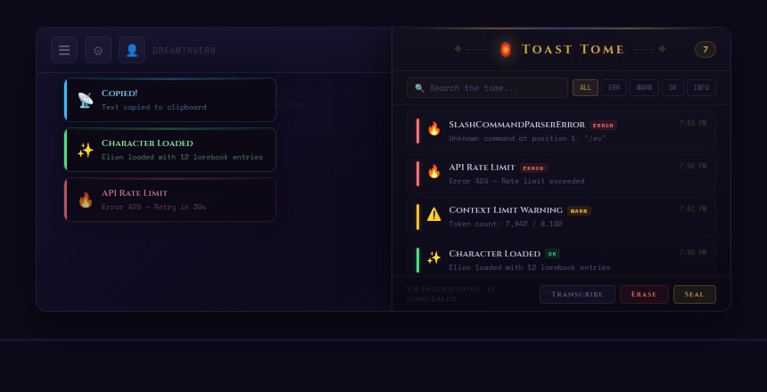
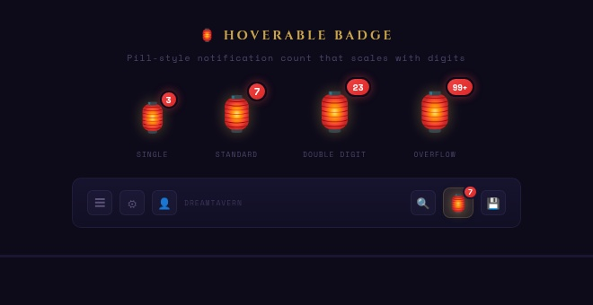
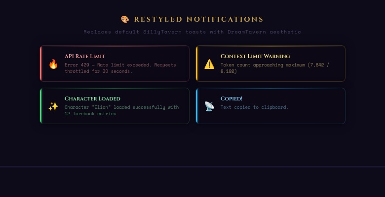
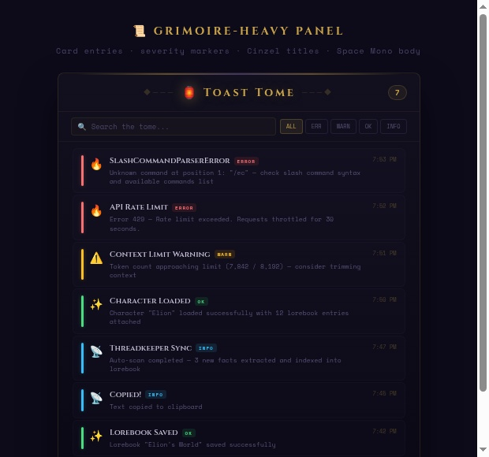
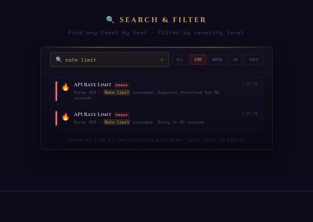
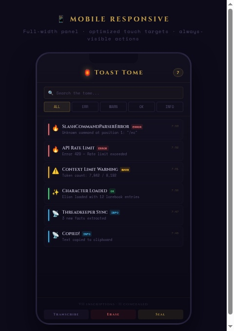

# 🏮 Toast Tome

**A DreamTavern extension for SillyTavern**

Replaces the default toastr presentation layer, stores notifications in a searchable grimoire-styled popup, and restyles all default SillyTavern toasts with a dark glass DreamTavern aesthetic.

Inspired by [SillyTavern-ToastHistory](https://github.com/LenAnderson/SillyTavern-ToastHistory) — rebuilt from scratch with a Grimoire-Heavy design language.

---

## Preview

### Full Context — Restyled Toasts + Grimoire Panel


*Restyled notifications floating over your chat. The Grimoire-Heavy popup opens when you click the 🏮 unread badge.*

---

### 🏮 Hoverable Badge


The lantern badge appears in your top settings bar only when unread toast messages exist. Tap or click it to open the popup interface. Closing the popup returns to the badge, and the badge stays visible until the toast history is actually cleared. The red notification pill scales from single digits to double digits to `99+` overflow.

---

### 🎨 Restyled Notifications


Every default SillyTavern toast gets the DreamTavern treatment:
- **Dark glass** background with backdrop blur
- **Left severity bar** — red (error), amber (warning), green (success), blue (info)
- **Top glow line** matching severity color
- **Cinzel** serif titles + **Space Mono** monospace body
- Same top-right overlay position, same auto-dismiss timing

---

### 📜 Grimoire-Heavy Panel


Click the 🏮 to open the compact popup:
- **Card entries** with left-side severity color markers
- **Emoji icons** per severity (🔥 error, ⚠️ warning, ✨ success, 📡 info)
- **Inline severity tags** — `ERROR` `WARN` `OK` `INFO`
- **Cinzel serif titles** + **Space Mono monospace** body text
- **◆─── ornamental** titlebar with Roman numeral footer
- **Timestamps** — "7:53 PM" for today, "Apr 27 7:53 PM" for older
- **Per-entry actions** — Copy (⎘) and Suppress (⊘) on hover

---

### 🔍 Search & Filter


Find any toast instantly:
- **Live search** — type in "Search the tome..." to filter by text content
- **Severity pills** — click `ERR`, `WARN`, `OK`, or `INFO` to filter by level
- **Combined** — search + filter work together (e.g., "rate limit" in errors only)
- **Match highlighting** in search results
- **Result count** in Cinzel footer ("Showing 2 of VII inscriptions matching...")

---

### 📱 Mobile Responsive


Works on any screen size:
- **Viewport-aware popup** on phones (≤600px)
- **Stacked toolbar** — search and filter pills reflow vertically
- **Always-visible actions** — no hover needed on touch devices
- **Larger touch targets** — 32px action buttons, taller pills
- **Full-width toasts** on mobile
- **Landscape mode** optimizations for horizontal phones
- Breakpoints at 768px (tablet), 600px (mobile), 480px (small phone)

---

## Installation

1. Navigate to your SillyTavern extensions folder:
   ```
   data/default-user/extensions/
   ```

2. Clone or unzip into the folder:
   ```
   SillyTavern-ToastTome/
   ├── manifest.json
   ├── index.js
   ├── style.css
   ├── mobile-styles.css
   ├── src/
   │   └── Settings.js
   ├── images/
   ├── README.md
   └── ARCHITECTURE.md
   ```

3. Restart / reload SillyTavern

4. Look for the 🏮 in your top settings bar — you're live

---

## Features

| Feature | Description |
|---------|-------------|
| 🏮 Unread Badge | Lantern icon appears only when unread toasts exist and stays until history is cleared |
| 📜 Popup Panel | Grimoire-Heavy popup interface with card entries and ornamental styling |
| 🎨 Default Toast Override | `toastr.info/success/warning/error` remain the app API, but Toast Tome becomes the default visual layer and history collector |
| 🔍 Search | Live text search across all toast history |
| 🏷️ Filters | Severity pills — ALL / ERR / WARN / OK / INFO |
| ⊘ Suppress | Block noisy toasts by pattern before they display (persists across reloads) |
| ◇ Concealments Manager | Review every suppressed pattern, allow individual notices again, or restore all at once |
| 📋 Copy | Copy individual toast text to clipboard with a fallback for older browsers |
| 📄 Export | Download full toast log as timestamped `.txt` file |
| 💾 Persistence | History survives reloads via `extension_settings` |
| 🧹 Auto-prune | Max 200 entries, auto-expire after 7 days |
| ⌨️ Slash Commands | `/toasttome` (toggle popup) + `/toasttome-blocks` (list blocks) |
| ⎋ ESC | Closes popup on Escape key |
| 👆 Outside Click | Closes popup when clicking outside |
| 📱 Responsive | Full mobile support with touch-optimized layout |

---

## Recent Changes

### 1.0.4 - 2026-09-20

Added:
- Added a slow unread lantern pulse animation for the Toast Tome badge.
- Added a persistent **Pulse On** / **Pulse Off** footer pill so users can disable the animation if it conflicts with their SillyTavern fork.
- Added mobile sizing support for the new pulse toggle.

Changed:
- The unread badge pulse now only runs when unread notifications exist and pulse animation is enabled.

### 1.0.3 — 2026-09-20

Added:
- Added a Grimoire-styled **Concealments** manager inside the Toast Tome panel.
- Added **Allow Again** controls for restoring individual suppressed notices.
- Added **Restore All** for clearing every suppression at once.
- Added responsive desktop and mobile layouts for suppression recovery.
- Escape now returns to inscriptions before closing the panel.

Fixed:
- Suppressions can now be reversed even after the original history entry expires or is erased.

### 2026-04-29 Session

Added:
- Improved Toast Tome mobile resizing so the popup interface fits narrow screens without clipping the toolbar, search field, or filter controls.
- Added safer wrapping and sizing for the severity filter pills on small phones.
- Added default Toast Tome timeout handling per severity while still allowing individual toast calls to override their own timing.

Fixed:
- Fixed the Toast Tome panel height and width behavior on mobile so it uses viewport-safe sizing instead of overflowing off-screen.
- Fixed search and filter controls being cut off in compact mobile layouts.
- Fixed toast timing consistency for success, info, warning, and error notifications.

Related session fixes outside Toast Tome:
- Backups Browser now filters the backup popup to the currently selected character.
- Top Info Bar now shows the actual selected Navy model instead of only showing `Navy - Valid`.
- Navy chat completion model metadata now reads more context and pricing formats so fewer models show missing context or price data.

---

## Slash Commands

| Command | Action |
|---------|--------|
| `/toasttome` | Toggle the popup open/close |
| `/toasttome-blocks` | Show all suppressed toast patterns as a toast notification |

---

## Settings & Persistence

All settings stored in `extension_settings.toastTome`:

| Setting | Default | Description |
|---------|---------|-------------|
| `maxHistory` | 200 | Maximum stored entries before oldest are pruned |
| `maxAgeDays` | 7 | Days before entries auto-expire |
| `captureInfo` | true | Capture info-level toasts |
| `captureSuccess` | true | Capture success-level toasts |
| `captureWarning` | true | Capture warning-level toasts |
| `captureError` | true | Capture error-level toasts |
| `hideList` | [] | Suppressed toast patterns |

---

## Panel Actions

| Button | Action |
|--------|--------|
| **Concealments** | Review suppressed patterns and allow them again individually or all at once |
| **Transcribe** | Export full history as `toast-tome-YYYY-MM-DD.txt` |
| **Erase** | Clear all history (cannot be undone) |
| **Seal** | Close the popup |

---

## Keyboard Shortcuts

| Key | Action |
|-----|--------|
| `ESC` | Return from Concealments, then close the popup |
| Click outside popup | Close the popup |

---

## Design Language

- **Primary accent**: Warm amber/gold `#c9a44a`
- **Title font**: Cinzel (serif, 400–700)
- **Body font**: Space Mono (monospace)
- **Background**: Deep purple-black gradient (`#12101e` → `#0a0814`)
- **Severity colors**: Red `#f87171` · Amber `#fbbf24` · Green `#4ade80` · Blue `#38bdf8`
- **Badge count**: Red pill `#ef4444` with border glow
- **Ornaments**: `◆───` diamond-and-line borders
- **Footer**: Roman numeral counts ("VII inscriptions · II concealed")

---

## Developer Reference

See **[ARCHITECTURE.md](ARCHITECTURE.md)** for:
- Complete file map with line counts
- Function-by-function documentation
- CSS class reference
- Color palette
- Common troubleshooting
- Extension guide

See **[CHANGELOG.md](CHANGELOG.md)** for versioned release notes.

---

## Credits

- **Design & Development**: DreamTavern
- **Inspiration**: [LenAnderson/SillyTavern-ToastHistory](https://github.com/LenAnderson/SillyTavern-ToastHistory)
- **Fonts**: [Cinzel](https://fonts.google.com/specimen/Cinzel) by Natanael Gama · [Space Mono](https://fonts.google.com/specimen/Space+Mono) by Colophon Foundry
- **Platform**: [SillyTavern](https://github.com/SillyTavern/SillyTavern)

---

*"Every notification deserves to be remembered."* 🏮
